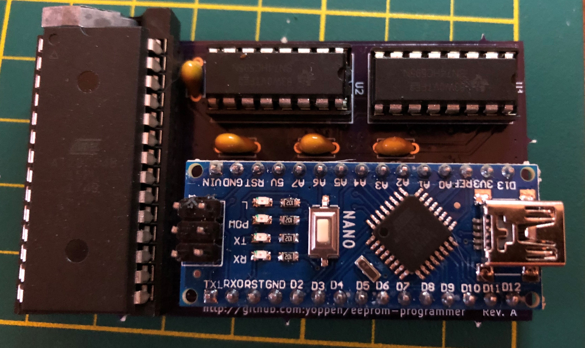

# eeprom-programmer
An Arduino Nano sketch and schematic for an Atmel 28cx programmer. The schematic started out only targeting 8kx8 chips (rev. A) but has been updated to connect all address lines for the 28cx series (rev. B), so any of those eeproms should work up to the 32kx8 chips.

The Arduino Nano sketch implements a serial interface to the programmer. It accepts one-letter commands:
- e - erase the eeprom
- f - fill eeprom with incrementing bytes
- h - help (this) text
- l - lock the eeprom against writes
- r - read and dump eeprom contents
- s - set the size of the eeprom
- u - unlock eeprom writes
- v - software version info
- x - xmodem transfer binary file to eeprom

Any standard terminal program can be used to talk to the programmer. I use the following:
- [serial](http://www.decisivetactics.com/products/serial/) for the Mac
- [teraterm](https://ttssh2.osdn.jp/index.html.en) for Windows
- [minicom](https://linux.die.net/man/1/minicom) for Linux

Be sure to se the size of your target eeprom with the s command before doing anything. It doesn't affect the chip in any way, but tells the programmer what size your chip is for the erase, fill and read commands and error checking in the xmodem transfer.

The programmer uses standard x-modem, as provided by any respectable terminal program—and certainly all of the
above listed terminal programs—to put binary files onto the eeprom. No other software is required. The programmer
will verify every 64 bytes as they are written (the size of an internal eeprom page).

Although the eeprom chips are supposed to come from the factory unlocked, I've heard stories of some chips being
purchased off ebay that arrive locked. Try doing an unlock on a chip if you have problems writing to it.

When doing an xmodem transfer to the chip, the program will wait indefinitely for you to start the xmodem transfer from your terminal software. You can abort the transfer at this point by pressing the ESC key. Otherwise, once you have started the transfer, it will continue until the process completes or an error is detected.

The circuit comes from [Ben Eater](https://youtu.be/K88pgWhEb1M). 

Here is a fresh board, built up after receipt from Osh Park.

